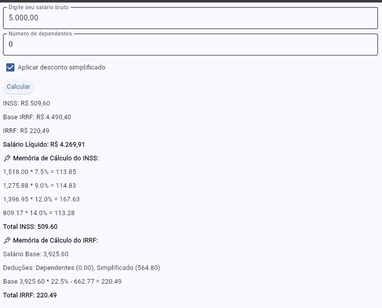

# 📌 Calculadora de INSS e IRRF

Este projeto é uma aplicação interativa desenvolvida em **Python** utilizando a biblioteca **Flet**, que permite calcular os descontos de **INSS e IRRF** sobre um salário bruto informado pelo usuário.


## 🔧 Tecnologias Utilizadas

<p align="left">
  
  
  
  
</p>


## 📌 Funcionalidades

- Entrada do **salário bruto**
- Seleção do **número de dependentes**
- Opção de aplicar o **desconto simplificado** no cálculo do IRRF
- Cálculo automático de **INSS, IRRF e salário líquido**
- Exibição detalhada da **memória de cálculo**

## 📌 Pré-requisitos

Antes de executar o projeto, certifique-se de que possui os seguintes requisitos instalados:

- **Python 3.11+**
- **Poetry** (Gerenciador de dependências)
- **WSL (Windows Subsystem for Linux)** (se estiver rodando no Windows)

Para instalar o **Poetry**, execute:
```bash
curl -sSL https://install.python-poetry.org | python3 -
```

## 🚀 Como Executar

1. **Clone ou baixe este repositório**
   ```bash
   git clone https://github.com/edvaldo-gutierres/calculadora_clt
   cd calculadora_clt
   ```
2. **Instale as dependências com Poetry**
   ```bash
   poetry install
   ```
3. **Ative o ambiente virtual do Poetry**
   ```bash
   poetry shell
   ```
4. **Execute o aplicativo**
   ```bash
   python main.py
   ```
5. **A interface abrirá automaticamente no navegador**.

## 📌 Estrutura do Projeto

A estrutura do projeto segue a seguinte organização:

```
calculadora_clt/
│── .gitignore               # Arquivo de exclusão do Git
│── .pre-commit-config.yaml  # Configuração para pre-commit hooks
│── main.py                  # Código principal da aplicação
│── poetry.lock              # Lockfile do Poetry para dependências
│── pyproject.toml           # Configuração do projeto e dependências
│── README.md                # Documentação do projeto
```

## 📌 Exemplo de Uso

1. Insira o **salário bruto** (exemplo: `5.000,00`).
2. Informe o número de **dependentes** (exemplo: `2`).
3. Escolha se deseja aplicar o **desconto simplificado**.
4. Clique no botão **"Calcular"**.
5. O sistema exibirá:
   - **INSS** calculado
   - **Base do IRRF**
   - **Valor do IRRF**
   - **Salário Líquido**
   - **Memória de Cálculo detalhada**
   

---
👨‍💻 Desenvolvido por [Edvaldo Gutierres](https://github.com/edvaldo-gutierres)